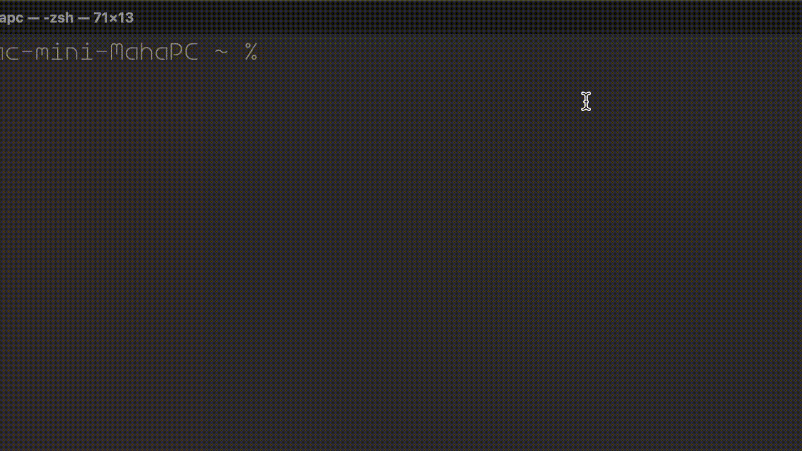

# Wing

A lightweight window manager for macOS. Snap windows to precise positions, switch between open windows across all Spaces, fix text typed in the wrong keyboard layout, and move any window to another Desktop — all with keyboard shortcuts. No SIP disable required.


## Features

- **Window Switcher** — hold Mod+Tab to cycle through open windows across all Spaces
- Snap windows to halves, quarters, and eighths of the screen
- Center any window at a configurable size with a single shortcut
- Configurable split ratios (left/right width, top/bottom height)
- **Window Control** — maximize/restore, minimize, close windows via hotkeys
- **Move to Desktop** — send the active window to any Desktop with Mod+Number
- **Text Switcher** — double-press Shift to convert recently typed text to the correct keyboard layout
- **Vim Motion** — use H/J/K/L as arrow keys with the modifier key
- All hotkeys fully configurable in Settings
- Menu bar app — lives quietly in the background
- Launch at Login option in Settings

## Installation

1. Mount the DMG and drag **Wing.app** to Applications
2. Run in Terminal:
```bash
xattr -cr /Applications/Wing.app
```
3. Open Wing.app normally

> macOS blocks unnotarized apps with *"Wing is damaged and can't be
opened. You should move it to the Trash."* — the command above removes the quarantine flag.

## Requirements

- macOS 26+
- Accessibility permission
- Automation permission (for Move to Desktop)
- Mission Control shortcuts enabled (for Move to Desktop) — see [details below](#requirements-for-move-to-desktop)

## Window Switcher


Hold your modifier key + Tab to open the switcher. Shows all open windows across all apps and all Spaces.

| Shortcut | Action |
|---|---|
| Mod + Tab | Open switcher / next window |
| ↑ / ↓ | Navigate the list |
| Release Mod | Switch to selected window |
| Escape | Cancel |

- Each window shows the Desktop number it belongs to
- If an app has multiple windows, each appears as a separate entry
- Switching to a window on another Space moves you there automatically

The Window Switcher can be enabled or disabled in Settings.

## Snap Shortcuts

Hold your chosen modifier key (Option, Command, or Control), then press arrow keys:

| Shortcut | Action |
|---|---|
| Mod + C | Center window (configurable size) |
| Mod + ← | Left half |
| Mod + → | Right half |
| Mod + ↑ | Top half |
| Mod + ↓ | Bottom half |
| Mod + ← + ↑ | Top left quarter |
| Mod + ← + ↓ | Bottom left quarter |
| Mod + → + ↑ | Top right quarter |
| Mod + → + ↓ | Bottom right quarter |
| ⇧ + Mod + ← + ↑ | Top left eighth |
| ⇧ + Mod + ← + ↓ | Bottom left eighth |
| ⇧ + Mod + → + ↑ | Top right eighth |
| ⇧ + Mod + → + ↓ | Bottom right eighth |

## Window Control

Configurable hotkeys for window management (defaults shown):

| Shortcut | Action |
|---|---|
| Mod + F | Maximize / Restore |
| Mod + Z | Minimize all windows |
| Mod + X | Minimize active window |
| Mod + Q | Close active window |

All keys can be changed in Settings. Window Control can be enabled or disabled independently.

## Move to Desktop

Press Mod+1 through Mod+9 to move the active window to the corresponding Desktop — without closing the app or losing any unsaved work.

**How it works:** macOS natively carries a dragged window to a new Space when you switch desktops during a drag. The app uses this behaviour:

1. Simulates holding the mouse button on the window's title bar
2. Switches to the target Desktop via a Ctrl+N keyboard shortcut
3. Releases the drag — the window is now on the target Desktop
4. Restores the window to its original position and size

Move to Desktop can be enabled or disabled in Settings.

### Requirements for Move to Desktop

1. **Mission Control keyboard shortcuts** must be enabled so the app can jump directly to the target Desktop in one keystroke. Go to **System Settings → Keyboard → Keyboard Shortcuts → Mission Control** and enable **Switch to Desktop 1** through **Switch to Desktop N** (for however many Desktops you use).


2. **Dock assignment** for the app being moved must be set to **Assign To → None** or **Assign To → This Desktop**. Right-click the app icon in the Dock → Options. If the app is set to **All Desktops**, macOS will show it on every Space and the window will not move to a specific Desktop.


## Text Switcher



Double-press Shift to instantly convert recently typed text to the correct keyboard layout. Useful when you start typing in English but your layout was set to Russian (or any other language) — or vice versa.

- Automatically detects all keyboard layouts installed on your Mac
- Converts text using the actual key positions (not a hardcoded character map), so it works with any combination of layouts — not just English and Russian
- If you have more than two layouts, each subsequent double-Shift cycles to the next one
- Select a word and press double-Shift to convert only that word
- After converting, the active keyboard layout switches to match the target language so you can keep typing
- Works in native macOS apps, browsers, Electron apps, and terminals

Text Switcher can be enabled or disabled in Settings.

## Languages

English, Русский, Deutsch, Français, Español, Italiano, Português, Polski, 中文, 日本語, हिन्दी

## Support the project

Wing is free and open-source. If you find it useful, consider [sponsoring the project](https://github.com/sponsors/capt-morgun) — it helps us keep building convenient software for everyday use.

---

[Русская версия](README.ru.md)
