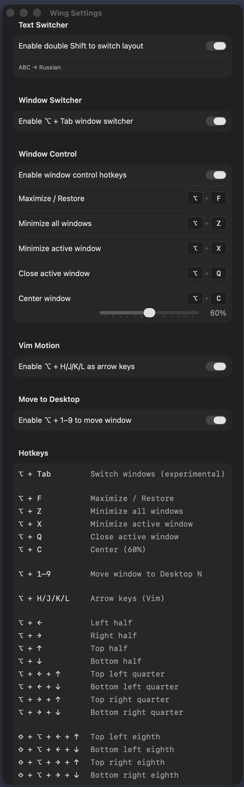
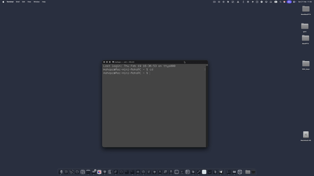
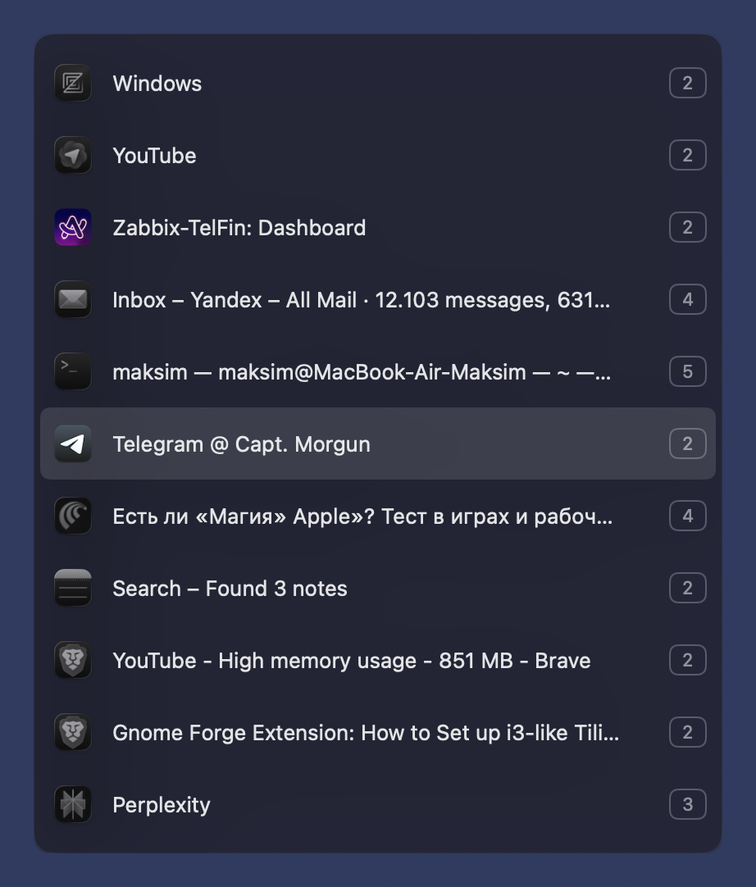
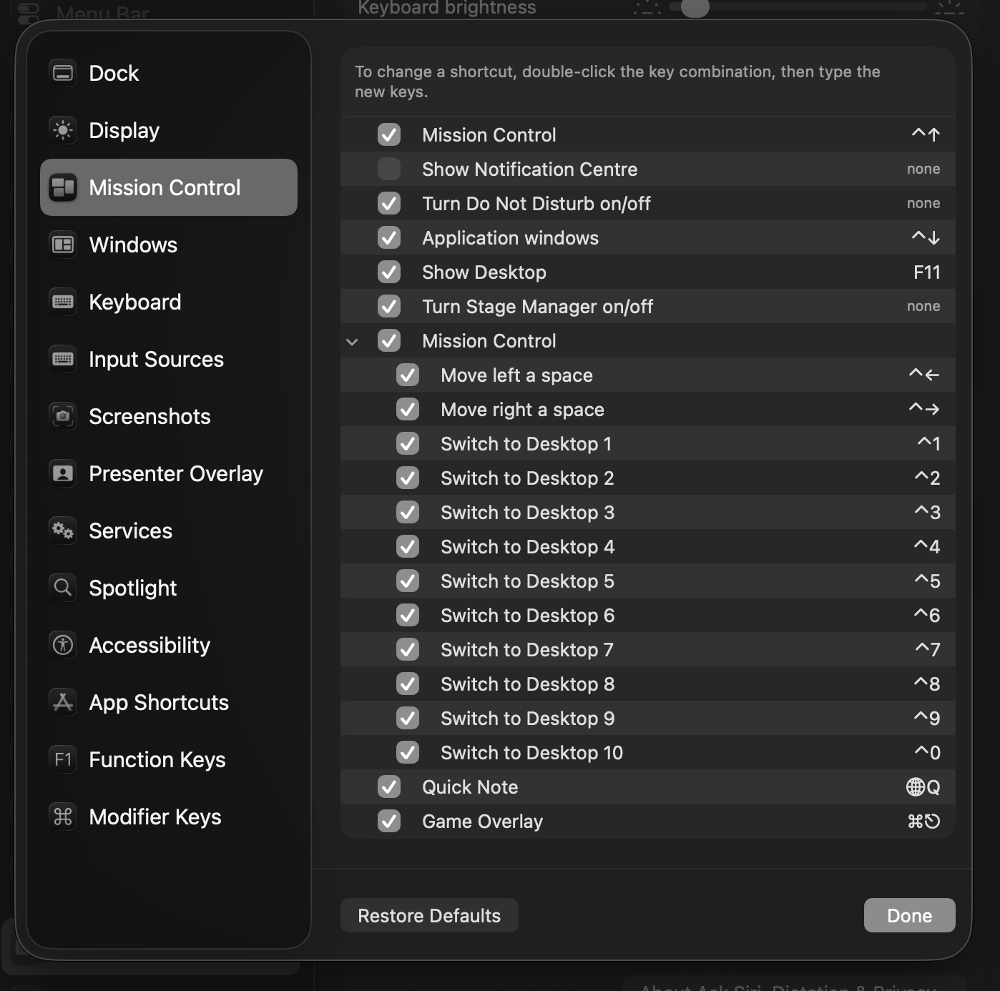
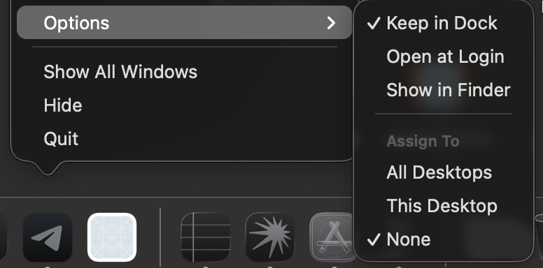

# Wing

Лёгкий менеджер окон для macOS. Прикрепляйте окна к точным позициям, переключайтесь между открытыми окнами во всех Spaces, исправляйте текст набранный не в той раскладке, и перемещайте окна на другой рабочий стол — всё через клавиатурные сочетания.





## Возможности

- **Переключатель окон** — удерживайте Mod+Tab для переключения между открытыми окнами во всех Spaces
- Прикрепление окон к половинам, четвертям и восьмым экрана
- Центрирование окна по настраиваемому размеру одним сочетанием клавиш
- Настраиваемые пропорции разделения (ширина левой/правой, высота верхней/нижней части)
- **Управление окнами** — разворачивать/восстанавливать, сворачивать, закрывать окна через горячие клавиши
- **Переместить на рабочий стол** — отправить активное окно на любой рабочий стол через Mod+Цифра
- **Переключатель раскладки** — двойной Shift для мгновенной конвертации набранного текста в правильную раскладку
- Все горячие клавиши полностью настраиваются в Настройках
- Приложение в строке меню — тихо работает в фоне
- Опция запуска при входе в систему

## Переключатель окон



Удерживайте клавишу-модификатор + Tab, чтобы открыть переключатель. Показывает все открытые окна всех приложений во всех Spaces.

| Сочетание | Действие |
|---|---|
| Mod + Tab | Открыть переключатель / следующее окно |
| ↑ / ↓ | Навигация по списку |
| Отпустить Mod | Переключиться на выбранное окно |
| Escape | Отмена |

- Каждое окно показывает номер рабочего стола, на котором оно находится
- Если у приложения несколько окон, каждое отображается отдельно
- Переключение на окно в другом Space выполняется автоматически

Переключатель окон можно включить или отключить в Настройках.

## Горячие клавиши прикрепления

Удерживайте выбранную клавишу-модификатор (Option, Command или Control), затем нажимайте стрелки:

| Сочетание | Действие |
|---|---|
| Mod + C | По центру (настраиваемый размер) |
| Mod + ← | Левая половина |
| Mod + → | Правая половина |
| Mod + ↑ | Верхняя половина |
| Mod + ↓ | Нижняя половина |
| Mod + ← + ↑ | Верхний левый квадрант |
| Mod + ← + ↓ | Нижний левый квадрант |
| Mod + → + ↑ | Верхний правый квадрант |
| Mod + → + ↓ | Нижний правый квадрант |
| ⇧ + Mod + ← + ↑ | Верхняя левая восьмая |
| ⇧ + Mod + ← + ↓ | Нижняя левая восьмая |
| ⇧ + Mod + → + ↑ | Верхняя правая восьмая |
| ⇧ + Mod + → + ↓ | Нижняя правая восьмая |

## Управление окнами

Настраиваемые горячие клавиши для управления окнами (показаны значения по умолчанию):

| Сочетание | Действие |
|---|---|
| Mod + M | Развернуть / Восстановить |
| Mod + D | Свернуть все окна |
| Mod + H | Свернуть активное окно |
| Mod + W | Закрыть активное окно |

Все клавиши можно изменить в Настройках. Управление окнами можно включить или отключить независимо.

## Переместить на рабочий стол

Нажмите Mod+1 … Mod+9, чтобы переместить активное окно на соответствующий рабочий стол — без закрытия приложения и потери несохранённых данных.

**Как это работает:** macOS автоматически переносит перетаскиваемое окно в новое пространство при переключении рабочего стола во время перетаскивания. Приложение использует это поведение:

1. Симулирует удержание кнопки мыши на заголовке окна
2. Переключается на целевой рабочий стол через сочетание Ctrl+N
3. Отпускает перетаскивание — окно оказывается на целевом рабочем столе
4. Восстанавливает окно на прежнем месте и размере

### Требования

**1. Горячие клавиши Mission Control** должны быть включены, чтобы приложение могло переходить напрямую к нужному рабочему столу одним нажатием.

Откройте **Системные настройки → Клавиатура → Сочетания клавиш → Mission Control** и включите **Переключить на Рабочий стол 1** … **Переключить на Рабочий стол N** (для всех используемых рабочих столов).



**2. Назначение в Dock** для перемещаемого приложения должно быть **Назначить → Нет** или **Назначить → Этот рабочий стол**. Нажмите правой кнопкой на иконку в Dock → Параметры.



Если приложение назначено на **Все рабочие столы**, macOS будет показывать его везде, и окно не переместится на конкретный рабочий стол.

Требуется разрешение Автоматизации (запрашивается при первом использовании), чтобы отправлять нажатия клавиш в System Events.

Функцию можно включить или отключить в Настройках.

## Переключатель раскладки

Двойное нажатие Shift мгновенно конвертирует недавно набранный текст в правильную раскладку. Полезно когда начинаете печатать по-английски, а раскладка стояла на русском — или наоборот.

- Автоматически определяет все установленные раскладки клавиатуры
- Конвертирует текст по реальным позициям клавиш (не по захардкоженной таблице символов), поэтому работает с любой комбинацией раскладок — не только английская и русская
- Если раскладок больше двух, каждое следующее двойное нажатие Shift переключает на следующую
- Выделите слово и нажмите двойной Shift — конвертируется только выделенное
- После конвертации раскладка переключается на целевой язык, чтобы можно было продолжить печатать
- Работает в нативных приложениях macOS, браузерах, Electron-приложениях и терминале

Переключатель раскладки можно включить или отключить в Настройках.

## Установка

1. Смонтируйте DMG и перетащите **Wing.app** в папку Программы
2. Выполните в Терминале:
```bash
xattr -cr /Applications/Wing.app
```
3. Откройте Wing.app обычным способом

> macOS блокирует ненотаризованные приложения с ошибкой *«повреждено и не может быть открыто»* — команда выше снимает флаг карантина.

## Требования

- macOS 13+
- Разрешение на доступ к функциям специальных возможностей
- Разрешение Автоматизации (для перемещения на рабочий стол)
